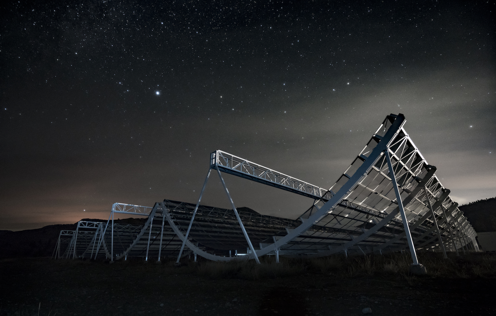
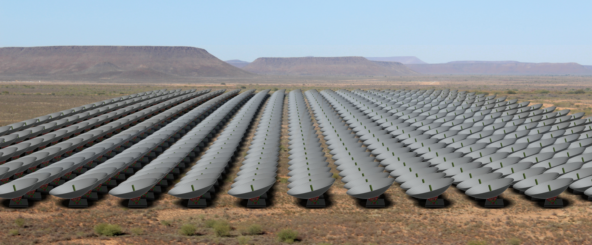

+++
title = "Research"
template = "simple-section.html"
+++

My research is in trying to understand the structure and behaviour of the Universe on
large scales, and using that to learn about fundamental physics. I am currently focused
on making observations of neutral hydrogen via the [21 cm
line](https://en.wikipedia.org/wiki/Hydrogen_line) to map the distribution of matter in
the Universe. As well as producing some of the largest maps in existence, by looking at
a statistical signal in the data ([baryon acoustic
oscillations](https://en.wikipedia.org/wiki/Baryon_acoustic_oscillations)) we are able
to constrain the rate of expansion of the Universe and use this to probe the nature of
[dark energy](https://en.wikipedia.org/wiki/Dark_energy). I am heavily involved in two
projects trying to do this:

## CHIME

<!--

-->

[CHIME](https://chime-experiment.ca/) is a novel radio interferometer built at the
[Dominion Radio Astrophysical Observatory](https://nrc.canada.ca/en/research-development/nrc-facilities/dominion-radio-astrophysical-observatory-research-facility) near Penticton in British
Columbia. CHIME is designed for mapping the distribution of neutral hydrogen between
redshifts 0.8 and 2.5, and constraining the equation of state of dark energy at a key
epoch. For an overview of CHIME see {{ arxiv(id="2201.07869") }}

CHIME is currently taking data and we are working our way towards BAO measurements. We
have recently released our first science results, cross correlations of CHIME data
against optical catalogs from eBOSS ({{ arxiv(id="2202.01242") }}).

{{ scaledimage(src="chime.jpg", alt="CHIME at night. Photo by Andre Renard", width="70%") }}

## HIRAX

<!---->

[HIRAX](https://hirax.ukzn.ac.za) is a radio interferometer currently under development that will
be built in the Karoo desert in South Africa. While the digital backend of HIRAX will be
quite similar to CHIME it has a radically different optical design using an array of 6
metre dishes instead of cylinders. For an overview of HIRAX see {{ arxiv(id="2109.13755") }}.

{{ scaledimage(src="hirax_karoo.jpg", alt="Rendering of HIRAX", width="70%") }}

## Other

In the past I have done significant work on primordial magnetic fields, looking at how
they impact the cosmic microwave background and large-scale structure observations. I've
also looked at how to calculate the non-linear effects of redshift-space distortions on
large-scale structure observables.